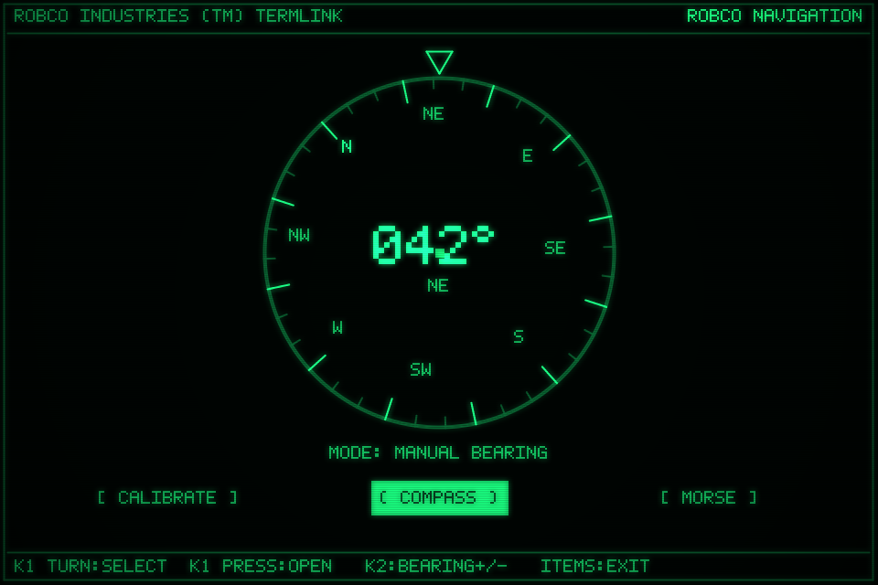
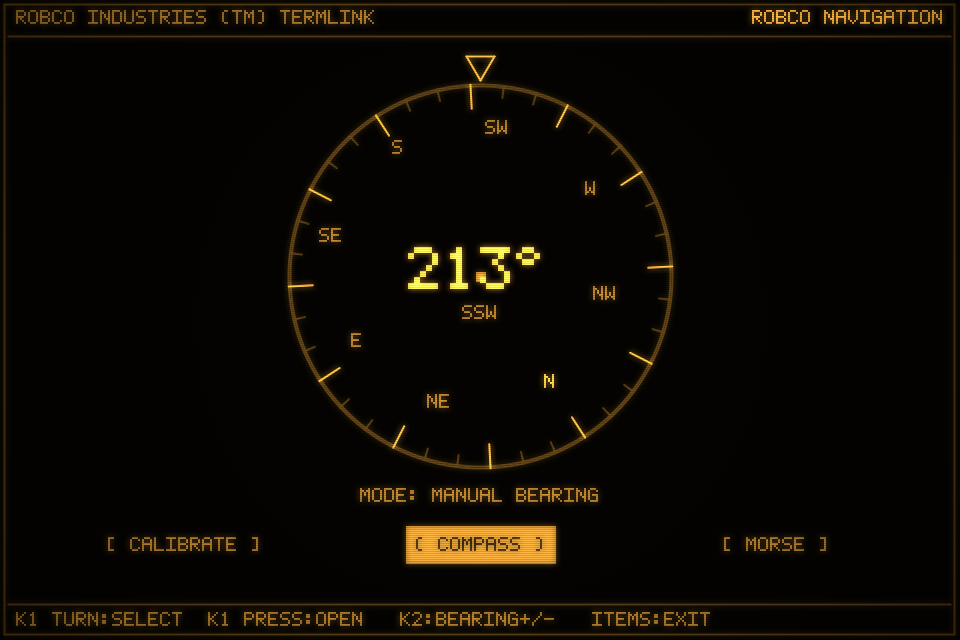
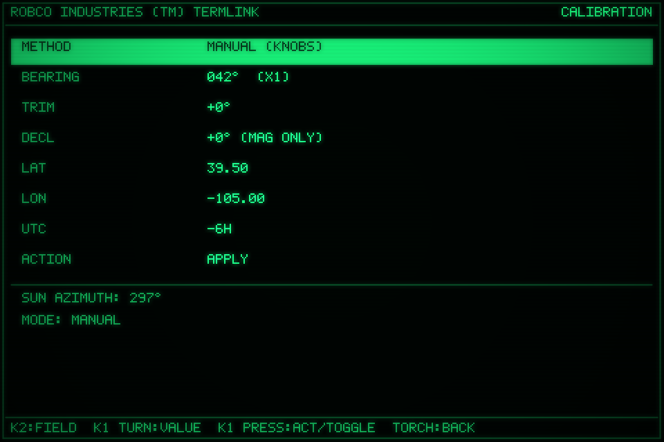
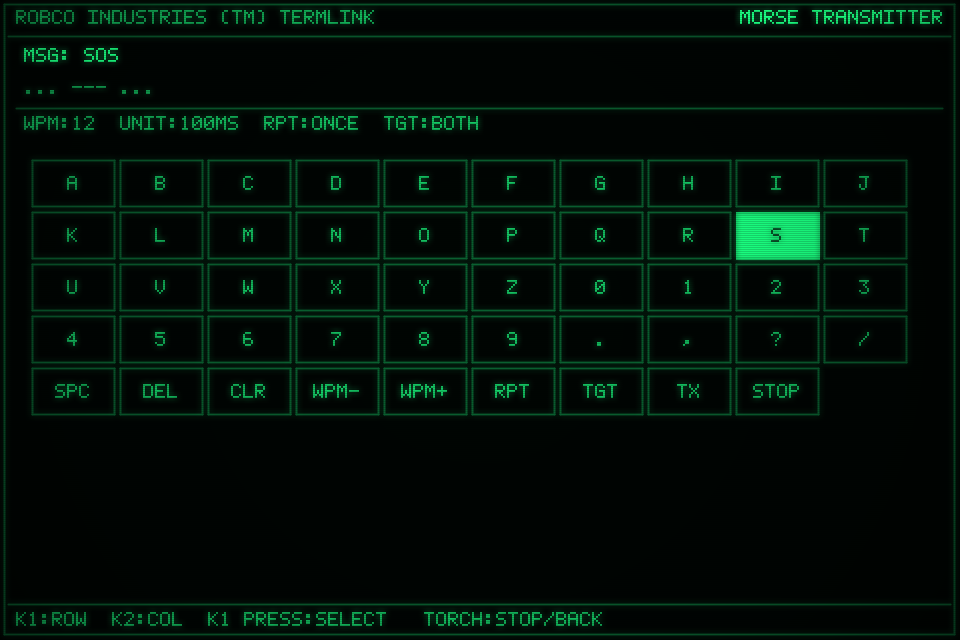
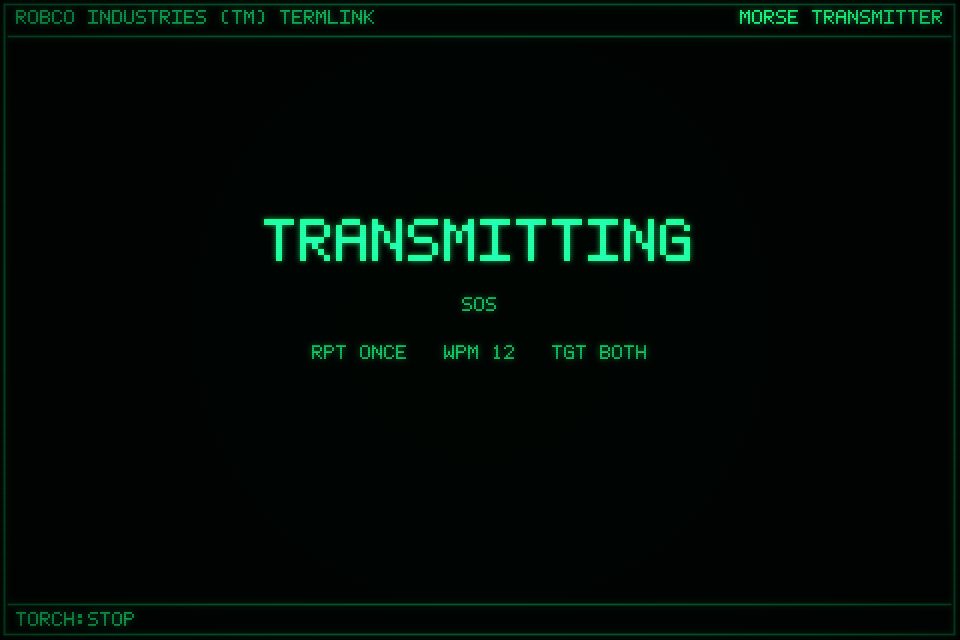

# Architecture — how Compass works

This is the engine-room tour. It explains, in order from the outside in, how one
~800-line file ([`src/COMPASS.JS`](../src/COMPASS.JS)) becomes a three-screen
RobCo navigation instrument — and *why* it is built the way it is.

You do not need to have written Espruino code before. Where something is
Pip-Boy-specific, it's called out.

**Contents**

1. [The 10,000-foot view](#1-the-10000-foot-view)
2. [The app contract (how the launcher runs us)](#2-the-app-contract)
3. [The graphics layer](#3-the-graphics-layer)
4. [Theme & colour](#4-theme--colour)
5. [Config & persistence](#5-config--persistence)
6. [The honest heading problem (the heart of the app)](#6-the-honest-heading-problem)
7. [Sensors: the accelerometer abstraction](#7-sensors-the-accelerometer-abstraction)
8. [Solar azimuth](#8-solar-azimuth)
9. [The Morse engine](#9-the-morse-engine)
10. [Screens, drawing & the dispatcher](#10-screens-drawing--the-dispatcher)
11. [Input handling](#11-input-handling)
12. [The ticker (the animation loop)](#12-the-ticker)
13. [Lifecycle & the `remove()` contract](#13-lifecycle--the-remove-contract)
14. [End-to-end data flow](#14-end-to-end-data-flow)

---

## 1. The 10,000-foot view

Everything lives inside **one function expression** that the Pip-Boy launcher
`eval()`s and calls. There are no modules, no bundler at runtime, no framework.
The whole app is a closure with private state and a handful of subsystems:

```
                          ┌─────────────────────────────────────────┐
   knob1 / knob2 / torch  │  INPUT HANDLERS  (onKnob1/onKnob2/onTorch)│
   ───────────────────────▶  mutate app state, then call redraw()     │
                          └───────────────┬─────────────────────────┘
                                          │
   ┌──────────────────────────────────────▼───────────────────────────┐
   │  APP STATE      screen ∈ {HOME, CAL, MORSE}, focus, cfg, msg …    │
   └───────┬───────────────────┬───────────────────┬──────────────────┘
           │                   │                   │
   ┌───────▼──────┐   ┌────────▼────────┐   ┌──────▼───────┐
   │ HeadingProv. │   │  Morse engine   │   │ Solar azimuth│
   │ (3 strategies)│   │ (pulse machine) │   │ (NOAA algo)  │
   └───────┬──────┘   └────────┬────────┘   └──────┬───────┘
           └───────────────────┴───────────────────┘
                               │
   ┌───────────────────────────▼───────────────────────────────────────┐
   │  DRAW DISPATCHER  draw() → drawHome | drawCalibrate | drawMorse     │
   │  → primitives on G → flip()  (native scanline/phosphor)            │
   └────────────────────────────────────────────────────────────────────┘
                               ▲
   ┌───────────────────────────┴───────────────────────────────────────┐
   │  TICKER  setInterval(tick, 120ms): smooth the rose, redraw if dirty │
   └────────────────────────────────────────────────────────────────────┘
```

A `tick` runs ~8×/second to animate the compass rose smoothly; input handlers
mark the screen "dirty" (`redrawPending`) and the next tick repaints. Drawing is
**immediate-mode**: every frame is redrawn from scratch onto the graphics
instance, then `flip()` pushes it to the panel.

---

## 2. The app contract

The launcher loads an app by reading `APPS/COMPASS.JS` and `eval`-ing it. The
file's top-level value must be a **function** (a *function expression*, with **no
trailing `()`** — the loader supplies the call). That function runs `start()` and
returns a small descriptor:

```js
return {
  id: appId,        // "COMPASS"
  notDefault: true, // a press of ITEMS closes the app (vs. returning to a default)
  fullscreen: true, // we own the whole panel — no OS header/top icons
  remove: cleanup   // MANDATORY teardown (see §13)
};
```

> **Why a function *expression*, not an IIFE?** The loader calls it for us. If you
> add a trailing `()` you'd run it twice; if the minifier deletes it as a
> "useless expression" you'd ship an empty file. The build is configured to
> prevent the latter — see [MAINTAINING.md → Footguns](MAINTAINING.md#footguns--gotchas).

---

## 3. The graphics layer

Different Pip-Boy firmwares expose the screen under different global names. The
3000 uses `h`; the Mk V exposes `g` (direct) and `bC` (a 2-bit offscreen buffer
whose `.flip()` produces the scanline effect). We **feature-detect** once and
keep a single handle `G` ([source](../src/COMPASS.JS#L41-L47)):

```js
var G = (typeof h !== "undefined" && h) ? h
      : (typeof bC !== "undefined" && bC) ? bC
      : (typeof g !== "undefined" && g) ? g : null;
var HAS_FLIP = !!(G && typeof G.flip === "function");
var W = G ? G.getWidth() : 480;
var H = G ? G.getHeight() : 320;
```

Two consequences ripple through the whole app:

- **Everything that touches `G` is wrapped** in a tiny helper that no-ops if `G`
  is missing or a primitive throws — `str()`, `line()`, `rect()`, `fillRect()`,
  `circle()`, `sw()` ([source](../src/COMPASS.JS#L72-L80)). The app degrades
  instead of crashing on an unfamiliar firmware.
- **`flip()` is called at the end of every screen draw** ([source](../src/COMPASS.JS#L623))
  and is a no-op when the firmware draws directly. That's what gives the screen
  the native phosphor/scanline look on hardware.

`setFontAlign` on Espruino uses **`-1 / 0 / 1`** for left/center/right (and
top/center/bottom) — *not* `0 / 0.5 / 1`. The `align(x, y)` helper exists so this
convention is in one place.

---

## 4. Theme & colour

A RobCo terminal is **one hue at several brightness levels on near-black** —
never two hues on screen at once. That rule is enforced structurally
([source](../src/COMPASS.JS#L54-L67)):

```js
var THEMES = { green: [0.10, 1.00, 0.50],   // Fallout 3  ~ #1AFF80
               amber: [1.00, 0.71, 0.26] }; // New Vegas  ~ #FFB642
var LEVEL  = [0.0, 0.30, 0.62, 1.0];        // 0 bg · 1 dim · 2 mid · 3 bright
```

You never call `setColor` directly. You call `col(level)` with `0..3`, which
multiplies the active theme hue by the level's brightness. On a 2-bit buffer the
result snaps to the nearest palette entry; on a true-colour `g` it renders the
real colour. Switching the whole UI between green and amber is therefore a single
`cfg.theme` flip.

| Green (`#1AFF80`) | Amber (`#FFB642`) |
|---|---|
|  |  |

---

## 5. Config & persistence

All user state lives in one plain object, `cfg` ([source](../src/COMPASS.JS#L94-L106)):
theme, held `bearing`, `trim`, magnetic `decl`ination, `lat`/`lon`/`locSet`,
`utcOff`, Morse `wpm`/`repeatMode`/`repeatCount`/`flashTarget`, and the optional
`motionEst` flag.

Persistence is **three-tier and fully guarded** because we don't know which
storage API a given firmware exposes ([source](../src/COMPASS.JS#L108-L128)):

```
readRaw(path):  require("fs").readFileSync  →  Storage.read  →  E.openFile
writeRaw(path): require("fs").writeFileSync →  Storage.write →  E.openFile
```

Every tier is wrapped in `try/catch`; a missing or corrupt `USER/COMPASS.SET`
file simply leaves the defaults in place. `loadCfg()` copies only keys that
already exist in `cfg` (so an old/foreign file can't inject junk), and `saveCfg()`
is best-effort — saving is never allowed to crash the app.

---

## 6. The honest heading problem

This is the design decision the whole app is organised around. **Read it before
judging the heading code.**

> An accelerometer measures **gravity** (which way is down), not heading. Rotate a
> level device about the vertical axis and the accelerometer reading does not
> change — so you **cannot** derive a compass heading from an accelerometer alone.

The Pip-Boy 3000 has a **confirmed accelerometer** but **no publicly confirmed
magnetometer or gyroscope**. A lesser app would fake a "compass" off the
accelerometer and be confidently wrong. Instead, the `Heading` provider
([source](../src/COMPASS.JS#L224-L340)) is one abstraction with **three
strategies**, and an on-screen `MODE:` line that always tells the truth about
which one is live:

| Strategy | Selected when | How it derives heading |
|---|---|---|
| **MANUAL BEARING** | accelerometer-only — **the confirmed hardware, so this ships** | The heading is the bearing you set in CALIBRATE; you nudge it by hand. Honest about the fact that continuous yaw can't be sensed. |
| **MAGNETIC** | a magnetometer is detected | True tilt-compensated compass (`magHeading()` uses the accel as a level reference and applies declination). |
| **DEAD-RECKONING** | a gyro (+accel) is detected | Calibrate to a known bearing, then integrate yaw-rate (`drHeading()`); damps drift when stationary; prompts re-cal. |

`probe()` picks the strategy at startup based on what the firmware exposes
([source](../src/COMPASS.JS#L233-L245)). On today's hardware that's `MANUAL`:


The MAGNETIC and DEAD-RECKONING branches are **fully implemented** and covered by
tests — they light up automatically if a future firmware exposes those sensors —
but they stay inert until then. The provider exposes a clean surface to the rest
of the app:

- `getRaw()` — instantaneous heading for the active strategy.
- `getHeading()` — `getRaw()` put through an **exponential moving average across
  the 0/360° wrap** (shortest-angle delta) so the rose glides instead of
  juddering ([source](../src/COMPASS.JS#L304-L309)).
- `setReference(trueBearing)` — "the lubber line points at *this* now." What it
  anchors depends on the mode: MANUAL sets the held bearing, DR resets the
  integrator, MAGNETIC adjusts declination so the live reading matches
  ([source](../src/COMPASS.JS#L311-L325)).
- `status()` / `modeName()` — the honest strings drawn on screen.
- `nudge(delta)` — the K2 ±1° tweak on the home screen.

---

## 7. Sensors: the accelerometer abstraction

The accelerometer read call is **not in the public SDK**, so `Accel`
([source](../src/COMPASS.JS#L137-L171)) probes several idioms and caches whichever
delivers data:

1. An **event stream** — `Pip.on('accel', …)` (most likely on this firmware),
   optionally turned on with `Pip.accelOn(rate)`.
2. **Poll methods** — `Pip.accelRd()`, `Pip.getAcceleration()`, `Pip.accel`.

It returns `{x, y, z}` in g, or `null` if nothing ever arrived. The app uses it
for the tilt-compensated magnetic branch, drift damping in dead-reckoning, the
optional (default-off) turn-gesture estimate, and shake-to-recenter. If no accel
is present, those features simply switch off and MANUAL bearing still works.

---

## 8. Solar azimuth

Because the device has no magnetometer and no GPS, the most accurate heading
reference available outdoors is **the sun**. `solarAzimuth()`
([source](../src/COMPASS.JS#L183-L208)) implements the NOAA solar-position
algorithm (fractional year → equation of time + solar declination → hour angle →
azimuth), fed UTC derived from the device clock and your saved `utcOff`. You aim
the lubber line at the sun, run `CAPTURE SUN`, and the app sets the reference so
*lubber direction = the sun's true azimuth at that instant*.

If no location is set, `coarseSolar()` ([source](../src/COMPASS.JS#L210-L217))
falls back to a rough N-hemisphere `sunrise ≈ E / noon ≈ S / sunset ≈ W`, and the
screen says so rather than pretending to be precise:



---

## 9. The Morse engine

Three cooperating pieces turn typed text into synchronised flashes.

**Encoding.** `MORSE_MAP` ([source](../src/COMPASS.JS#L345-L353)) holds the
dot/dash strings. `morseOf(msg)` ([source](../src/COMPASS.JS#L355-L372)) flattens
a message into a list of pulses `{on, units}` using standard relative timing —
dot = 1 unit, dash = 3, intra-character gap = 1, inter-character = 3, inter-word =
7. `morsePreview(msg)` renders the live `· —` line you see while composing.

**Output.** `torchSet(on)` ([source](../src/COMPASS.JS#L384-L390)) tries a
`Pip.torch`/`setTorch` hook *and* drives the addressable green panel LED via
`digitalWrite(LED_GREEN, …)`. `applyFlash(on)` ([source](../src/COMPASS.JS#L401-L404))
routes a pulse to the screen, the LED, or both according to `cfg.flashTarget`.

**The state machine.** `tx` holds the running transmission; `txStep()`
([source](../src/COMPASS.JS#L405-L420)) consumes one pulse, sets the flash, draws
immediately so the **screen flash stays exactly in sync** with the LED, and
schedules the next step `unitMs() * pulse.units` later. `unitMs()` is `1200 / WPM`
(the PARIS standard). At the end of a pass it honours the repeat mode
(`ONCE` / `×N` / `LOOP`).




**Stopping is instant and total.** `txStop()` and `txClear()`
([source](../src/COMPASS.JS#L394-L398)) kill the pending timer, reset the chain,
and force the torch/LED off — there are no orphaned flashers, ever. The torch
button is the panic stop.

---

## 10. Screens, drawing & the dispatcher

State `screen` is one of `SCR.HOME | SCR.CAL | SCR.MORSE`
([source](../src/COMPASS.JS#L434-L435)). `draw()` is a three-way dispatcher
([source](../src/COMPASS.JS#L625-L630)); each branch fully repaints.

Shared chrome lives in small helpers — `frame()` (background + border),
`header(title)` (the `ROBCO INDUSTRIES (TM) TERMLINK` banner + a right-aligned
screen title), and `footer(text)` (the live key-binding legend at the bottom of
every screen).

- **`drawHome()`** ([source](../src/COMPASS.JS#L517-L547)) draws the rotating rose
  via `compassDisc(cx, cy, r, heading)` — ticks every 10° (major every 30°),
  cardinal/intercardinal letters with North brightest, a fixed lubber triangle at
  top, the big numeric readout, the cardinal label from `cardinalLabel()`, the
  honest `MODE:` line, and the three soft buttons.
- **`drawCalibrate()`** ([source](../src/COMPASS.JS#L549-L579)) is a field list —
  `METHOD · BEARING · TRIM · DECL · LAT · LON · UTC · ACTION` — with the selected
  row inverted, plus a live solar-azimuth preview and the current mode.
- **`drawMorse()`** ([source](../src/COMPASS.JS#L584-L621)) draws either the
  compose view (message + preview + settings strip + 5×N keypad grid, with the
  cursor cell inverted — the Calculator idiom) **or**, while transmitting, a full
  bright fill on a pulse and a dim "TRANSMITTING" plate during gaps.

---

## 11. Input handling

Three event sources, re-interpreted per screen
([source](../src/COMPASS.JS#L660-L697)):

| Control | HOME | CALIBRATE | MORSE |
|---|---|---|---|
| **K1 turn** | move button highlight | change selected field's value | move keypad **row** |
| **K1 press** (`dir === 0`) | open highlighted screen | context action / run ACTION | select key under cursor |
| **K2 turn** | nudge bearing ±1° | move field selection | move keypad **column** |
| **TORCH** | — | back to HOME | STOP transmit, else back |
| **ITEMS** | exit app (via `notDefault:true`) | — | — |

Note that **K2 is turn-only** on this firmware (no press), so no interaction ever
*requires* a K2 press. Each handler ends by `beep()`-ing and calling `redraw()`,
which just sets a dirty flag; the actual repaint happens on the next tick.

---

## 12. The ticker

`start()` installs `setInterval(tick, 120)` (~8 fps)
([source](../src/COMPASS.JS#L637-L643)). On HOME, `tick()` always marks the frame
dirty so the EMA-smoothed rose animates; on the other screens it only repaints
when something set `redrawPending`. This is what keeps the rose gliding while idle
without burning CPU on static screens. The optional `motionEstimate()`
([source](../src/COMPASS.JS#L648-L655)) lives here too — a clearly-labelled,
default-off, low-confidence turn nudge derived from lateral acceleration.

---

## 13. Lifecycle & the `remove()` contract

`start()` ([source](../src/COMPASS.JS#L753-L767)) loads config, inits the accel,
probes the heading strategy, seeds the display, attaches the three `Pip.on`
listeners, draws once, and starts the ticker.

`cleanup()` — returned as `remove` — is **mandatory and must be airtight**
([source](../src/COMPASS.JS#L769-L787)). When the user exits, it:

1. clears the ticker interval,
2. clears the transmit chain (which also turns the torch/LED off),
3. forces the torch off again belt-and-suspenders,
4. detaches every `Pip.on` listener (with a `removeAllListeners` fallback),
5. stops the accel, and
6. flushes `cfg` to disk.

A leaked timer or listener here would keep firing into a dead app and corrupt the
next app the user opens. The test harness asserts this teardown is complete.

---

## 14. End-to-end data flow

Putting it together — one full cycle of "user turns a knob on HOME":

```
  K2 turn ─▶ onKnob2(dir)
            └▶ Heading.nudge(±1)        # MANUAL: cfg.bearing += ±1
            └▶ beep("CLICK"); redraw()  # sets redrawPending = true
                                  │
  setInterval tick (120ms) ───────▼
            └▶ redrawPending → draw()
                 └▶ drawHome()
                      ├▶ Heading.getHeading()   # EMA toward new bearing
                      ├▶ compassDisc(...)        # ticks/letters/lubber
                      ├▶ col()/str()/line()/...  # primitives onto G
                      └▶ flip()                  # native scanline push
```

And "user transmits SOS on MORSE":

```
  press TX ─▶ morseActivate() ─▶ txStart()
            └▶ tx.seq = morseOf("SOS")          # pulse list
            └▶ txStep():
                 applyFlash(pulse.on)           # screen flag + LED
                 draw()                          # bright fill OR plate
                 setTimeout(txStep, unitMs*units)
            … repeats; repeat-mode decides re-runs …
  TORCH / STOP ─▶ txStop() ─▶ txClear()         # timer killed, LED off
```

---

### Where to go next

- **Change something?** → [MAINTAINING.md](MAINTAINING.md) has copy-paste recipes
  and the build/test/screenshot pipeline.
- **The hardware facts** behind every feature-detection branch are tabulated in
  the [main README → Hardware assumptions](../README.md#hardware-assumptions).
