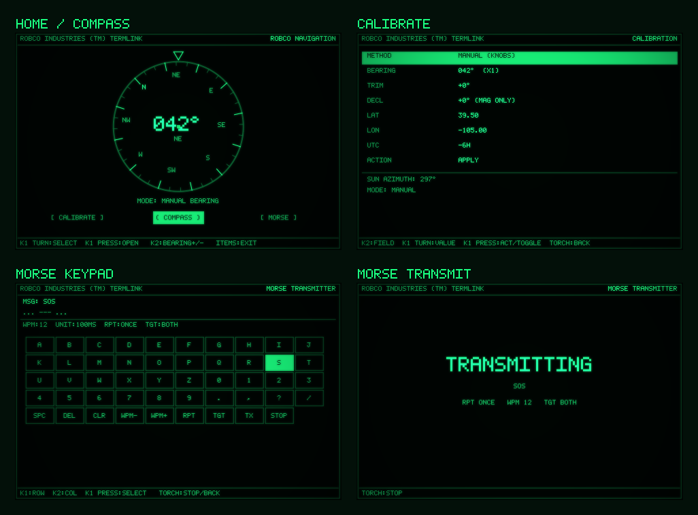

# Compass — Documentation

> RobCo Navigation instrument for **The Wand Company Pip-Boy 3000**.
> This folder is the deep-dive companion to the top-level [README](../README.md).

If you just want to **install and use** the app, start with the
[main README](../README.md#install) or open the one-click
[`install.html`](../install.html) (Chrome/Edge).

If you want to **understand or take over the code**, read these two guides — they
are written to get a new maintainer productive fast, in plain language, with
pictures.

| Guide | Read it when you want to… |
|---|---|
| **[ARCHITECTURE.md](ARCHITECTURE.md)** — *how the program works* | Understand the engine room: how a single 800-line file becomes three screens, how the "honest compass" decision is implemented, how drawing/persistence/Morse/heading all fit together. |
| **[MAINTAINING.md](MAINTAINING.md)** — *taking over the code* | Set up the toolchain, run the build/test/screenshot pipeline, and follow copy-paste recipes for the changes you'll actually make (add a screen, add a field, light up a magnetometer, retheme, regenerate these screenshots, ship to the device). |

---

## The app at a glance

Three screens, one knob-driven instrument:

| Screen | Picture | What it is |
|---|---|---|
| **HOME** | [01-home.png](../screenshots/01-home.png) | A rotating compass rose with a big numeric heading, an honest `MODE:` line, and three soft buttons. |
| **CALIBRATE** | [02-calibrate.png](../screenshots/02-calibrate.png) | Set the held bearing manually or capture the sun's true azimuth; set location/UTC/declination/trim; toggle theme; reset. |
| **MORSE** | [03-morse-keypad.png](../screenshots/03-morse-keypad.png) · [04-morse-transmit.png](../screenshots/04-morse-transmit.png) | A grid keypad to compose a message, then flash it on the screen and the LED/torch with correct Morse timing. |

> **Every screenshot in this documentation is generated, not hand-drawn.**
> `node tools/render-screens.cjs` evaluates the *real* app factory from
> [`src/COMPASS.JS`](../src/COMPASS.JS) against a software rasterizer that
> implements the same Espruino `Graphics` calls the device provides, then
> captures the framebuffer. If the UI changes, re-running that script updates
> every image here automatically — so the docs can never quietly drift from the
> code. See [MAINTAINING.md → Regenerate the screenshots](MAINTAINING.md#recipe-regenerate-the-screenshots).
